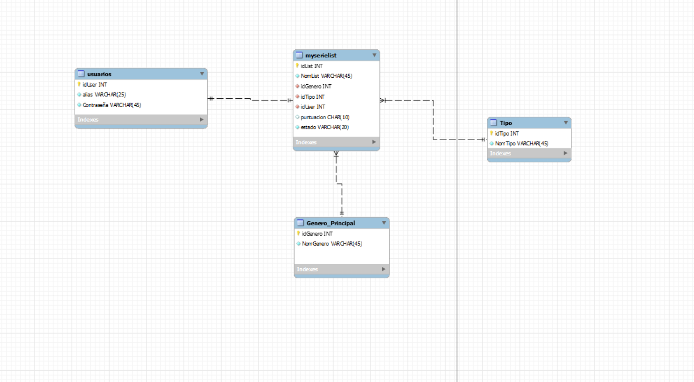
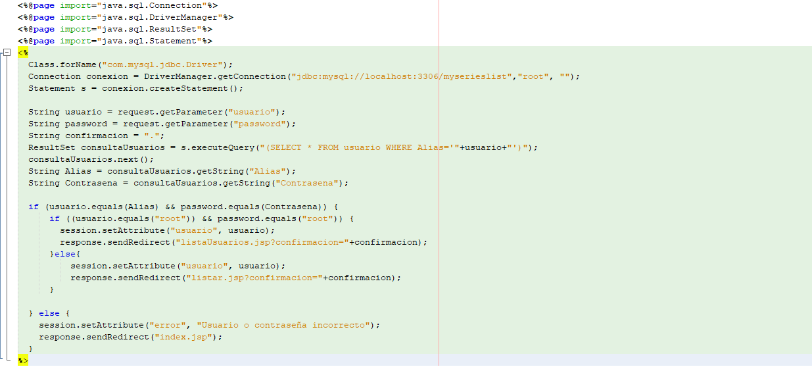

# MySerieList

## --> Introduccion <--
Como su nombre indica, será una aplicación en la que se podrán añadir, modificar y borrar Series/Peliculas/Documentales... vistas, así como añadir información relevante sobre el mismo. El código utilizado se encuentra en la carpeta CRUD de este repositorio.

La funcionalidad de esta aplicacion es recordarte que series,comics,peliculas... has visto o tienes pendiente por ver. Esta idea me surgio debido a que uno de mis pasatiempos es ver anime y leer mangas. Y he visto tantos que cuando me preguntan amigos o conocidos que les puedo recomendar nunca me acuerdo de las series que vi hace tiempo o con un nombre muy complicado. Y seguro que a mas de una persona le pasa igual, por eso he decido hacer esta aplicacion que recopila todas las series que has visto o tienes pendiente de ver, sea cual sea el tipo.

Para ir entrando en detalles, en la siguiente imagen se puede apreciar el modelo relacional de mi base de datos. En la que los requisitos han sido: De los usuarios necesitare saber el alias y su contraseña, así como el código. De las series y lo relacionado quiero saber el código, el nombre, el genero principal, el tipo , la puntuación y estado.Un usuario solo podrá acceder a su propia lista. El usuario solo puede tener una lista.  Una lista puede tener un usuario como máximo y como mínimo 1.

Puesto que habrán muchos géneros y tipos, he preferido sacarlos como una tabla independiente.

### 1º: index/login

Lo primero que  veras al entrar en la aplicacion sera un formulario de Logeo. En el que podras entrar usando el usuario "usuario" y su contraseña correspondiente (usuario). Si los datos son erroneos no te permitira avanzar a la pagina principal. Que en este caso sera el listado de todas las series, peliculas, documentales, mangas, podcasts... Que el usuario ha ido viendo. 

El codigo que he usado en para validar el Login es el siguiente, el index pasa primero por este archivo (login.jsp) y valida que el usuario existe y guarda el parametro en una variable de sesion para despues de ser validado enviarme a la pagina del listado.

### 2º: Vista para los Usuarios y Logout
Después de que el usuario haya sido validado, podra ver la lista de sus series y peliculas que tiene, en el caso de no tener podra añadirlas usando el boton añadir. Tambien podra modificar datos y borrar esos datos. En todos los casos pasara por su archivo correspondiente.

Podemos ver como tambien tenemos 2 botones adicionales, los cuales mas adelante son explicados y podeis ver su funcion mediante las capturas de pantalla.

En el caso de que el usuario quiera cerrar sesion dara click en salir y esta pasara por el archivo logout.jsp enviandolo al index y borrando la variable de sesión. Aqui puedes ver el codigo.

### 3º: Registro Usuario

Si llega un nuevo usuario y quiere registrarse, presionaria el boton en la pagina de login de registrar y lo llevaria a esta pagina, en la que puede poner su alias y su contraseña. El formulario de registro es algo sencillo. Ademas al ser el Alias UNIQUE en la base de datos, los nombres no podran repetirse, si se crea el usuario con exito este aparece con una alerta.

  
  

Aqui esta el codigo que uso para comprobar que el usuario no exista y que pueda registrarse. Dependiendo del valor de la variable confirmacion podra mostrar un mensaje u otro.

### 4º: Añadir

Esta parte se activa al introducir datos en el formulario de listar, cuando el usuario presione sobre añadir y previamente con los datos añadidos , se añadira automaticamente y le confirmara que ha sido añadida exitosamente.

  
  

### 5º: Borrar

Cuando el usuario presione este boton, borrara la linea y un mensaje de que el borrado ha sido exitoso. Este boton es algo peligroso, ya que si pulsas por error no hay vuelta atras.

### 6º: Modificar

El usuario al presionar este boton es redirigido a una pagina en la cual podra modificar los datos de la linea previamente seleccionada. En la cual tendra dos botones uno para volver si ha presionado por error y otro para aplicar los cambios,en el que si hace click este aplicara los cambios y lo redigira a la pagina principal de nuevo ademas de mostrarle un mensaje diciendo que los cambios se han producido.

  
  

### Los usuarios que se usan para probar la aplicacion son usuario ( pasword: usuario) y root ( pasword: root). Aunque tambien te recomiendo que pruebes a crear tu propio usuario :D.
